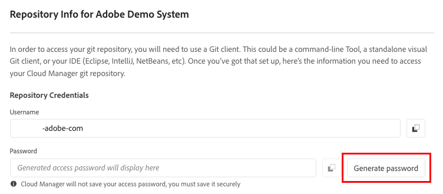
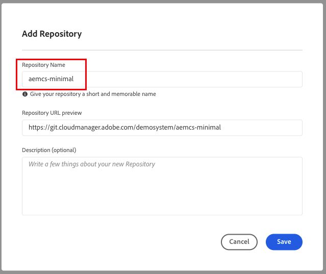
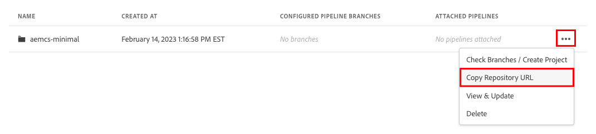
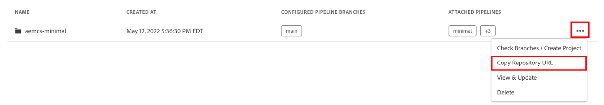

Starter Repo for Adobe Experience Manager as a Cloud Service
===

Start you Adobe Experience Manager cloud projects with a default repository and directly include maintained versions
of some additional handy features.

## Obtain Repo Credential to AEM Program in Cloud Manager

1.	Click `Repositories` from Cloud Manager menu

      

2.    Click `Access Repo Info`

      

3.    `Username` and `Password` are prompted and used for repository changes

      

      :warning: NOTE: Generated access password will only display in plain text view at initial generation.  Please copy it down elsewhere for later use.

## Add a New Repo to AEM Program in Cloud Manager

1.	Click `Repositories` from Cloud Manager menu

      

2.	Click `Add Repository` from Repositories screen

      

3.	Enter `aemcs-minimal` as repository name, click `Save`

      

4.    Click `...` to expand action menu, click `Copy Repository URL`

      

## Add Minimal Repository Content to New Respository

1.    Open `Terminal` (if using MacOS) or Open `Command Prompt` (if using Windows)
      
      Download content into a folder, type

      ```
      git clone https://github.com/AdobeAEMXSC/minimal.git
      ```

2.	Navigate to downloaded content folder, type

      ```
      cd minimal
      ```

3.    Add a new remote `adobe` to new repo created in Cloud Manager, type the following in `Terminal` or `Command Prompt`
      
      ```
      git remote add adobe ###YOUR COPIED REPOSITORY URL###
      ```

      :warning: NOTE: Replace `###YOUR COPIED REPOSITORY URL###` with the copied repository URL from your AEM Program in Cloud Manager

4.    Push all the changes in remote `adobe` as the `main` branch in new repo created in AEM project in Cloud Manager, type the following in `Terminal` or `Command Prompt`

      ```
      git push adobe main:main
      ```

5.    credentials, if prompted, can be obtained by following instructions from [Repo Credential to AEM Program in Cloud Manager section](#Obtain-Repo-Credential-to-AEM-Program-in-Cloud-Manager)

## Update Existing Repo with Content from Minimal

1.	Click `Repositories` from Cloud Manager menu

      

2.	Click `…` associated with `aemcs-minimal`, the click `Copy Repository URL`

      

3.	Open `Terminal` (if using MacOS) or Open `Command Prompt` (if using Windows)
      
      Download `aemcs-minimal` content into a folder, type
      
      ```
      git clone ###YOUR COPIED REPOSITORY URL###
      ```

      :warning: NOTE: Replace `###YOUR COPIED REPOSITORY URL###` with the copied repository URL from your AEM Program in Cloud Manager

4.	Navigate to downloaded content `aemcs-minimal` folder, type

      ```
      cd aemcs-minimal
      ```

5.	Remove all files and directories, type

      ```
      git rm -rf .
      ```

6.    Clean all unstaged files, type

      ```
      git clean -fxd
      ```

7.    Commit all changes to git, type

      ```
      git commit -a -m "clean"
      ```

8.    Download latest content from `minimal`, type

      ```
      git clone https://github.com/AdobeAEMXSC/minimal.git
      ```

9.    Copy downloaded latest content from `minimal` into `aemcs-minimal`

      * If MacOS, type

      ```
      cp -r minimal/* .
      cp minimal/.gitignore .
      cp minimal/.gitmodules .
      ```

      * If Windows, type

      ```
      xcopy /S /I /E minimal .
      ```

10.   remove `minimal` folder, type

      ```
      rm -rf minimal
      ```

12.   Commit all new files to git, type

      ```
      git add --all
      ```

13.   Commit all changes to git, type

      ```
      git commit -am "updated aemcs-minimal"
      ```

14.   push all commits back to `aemcs-minimal`, type

      ```
      git push
      ```
